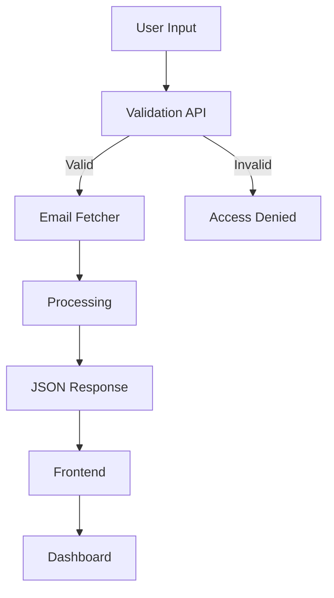
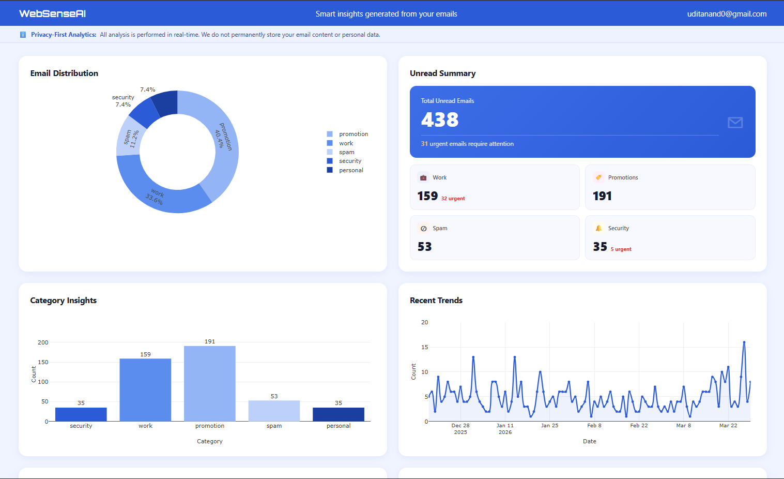

# 🚀 MailSenseAI – Email Analytics Dashboard

MailSenseAI is a web-based system that analyzes emails and converts them into meaningful insights using API-driven processing and interactive visualizations.

The system fetches recent emails, classifies them into categories, and presents analytics through a dashboard.

## 📌 Overview
Fetches latest 500 emails using IMAP
Extracts structured data (from, subject, date, status, body)
Applies heuristic NLP for email classification
Generates insights and visualizations using Plotly
Fully API-driven architecture

## 🧩 Architecture
🔹 Backend APIs (Python)
1. Email Validation API
Verifies email credentials
Returns boolean (true/false)
Ensures secure access before processing

👉 API Link:
[link](https://github.com/UditAnand85/email_verificationAPI)

2. Email Fetcher API
Connects via IMAP
Fetches latest 500 emails
Cleans and preprocesses data
Applies classification into:

   - Security
   - Promotions
   - Work
   - Personal
   - Spam
   - Unknown

Returns structured JSON

👉 API Link:
[link](https://github.com/UditAnand85/email_fetcherAPI)

## 🔹 Frontend
 - Built using HTML, CSS, JavaScript
 - Fetches API data using fetch()
 - Processes insights dynamically
 - Uses Plotly.js for charts

## 🔄 System Flow
📊 High-Level Flow

## ⚙️ Data Processing Flow

### 📊 Dashboard Insights

The dashboard generates:

## 🛠️ Tech Stack
  - Frontend: HTML, CSS, JavaScript
  - Visualization: Plotly.js
  - Backend: Python APIs,FastAPI,Python(Email library)
  - Data Processing: Pandas, NLP heuristics

## 🔐 Security
 - No database or persistent storage used
 - No email data stored on disk
 - Credentials are not saved
 - All processing is done in-memory
 - Uses app passwords instead of primary credentials

## 👤 Author
Udit Anand

B.Tech AI/ML Student | Building AI-powered products | Gate-DA AIR 1863

🔗 [GitHub](https://github.com/UditAnand85) 

🔗 [LinkedIn](https://www.linkedin.com/in/udit-anand-a5b712317/)

🔗 [EmailID](uditanand28@gmail.com)

